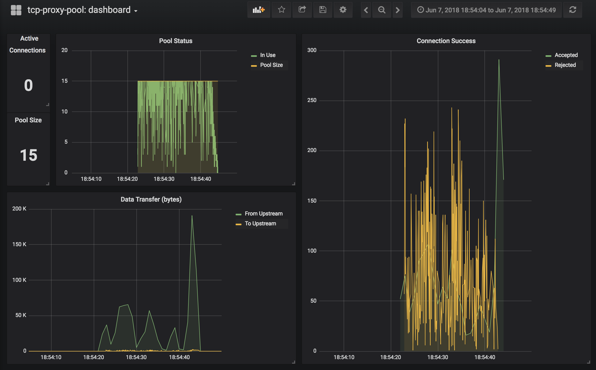

# tcp-proxy-pool #
golang-based application to create a TCP proxy server from a pool of back-end connections



## Getting Started

### Prerequisites
* Local [golang](https://golang.org/) installation; see [https://nextmetaphor.io/2016/12/09/getting-started-with-golang-on-macos/](https://nextmetaphor.io/2016/12/09/getting-started-with-golang-on-macos/) for details on how to install on macOS
* Local [dep](https://golang.github.io/dep/) installation

### Install

#### Building the Code
First restore the vendor dependencies:
```
$ dep ensure
```

Alternatively, manually install the vendor dependencies:
```bash
dep init

# aws sdk for ecs integration
dep ensure -add github.com/aws/aws-sdk-go@1.13.49

# logging
dep ensure -add github.com/sirupsen/logrus@1.0.5

# command line arguments
dep ensure -add github.com/alecthomas/kingpin@2.2.6

# container management
dep ensure -add github.com/aws/aws-sdk-go-v2
```

Then simply build the binary:
```bash
$ go build -i
```

## Deployment

### Command Line Options

### Running The tcp-proxy-pool Server

## Validation

## Licence ##
Licensed under the Apache License, Version 2.0 (the "License");
you may not use this file except in compliance with the License.
You may obtain a copy of the License at

    http://www.apache.org/licenses/LICENSE-2.0

Unless required by applicable law or agreed to in writing, software
distributed under the License is distributed on an "AS IS" BASIS,
WITHOUT WARRANTIES OR CONDITIONS OF ANY KIND, either express or implied.
See the License for the specific language governing permissions and
limitations under the License.